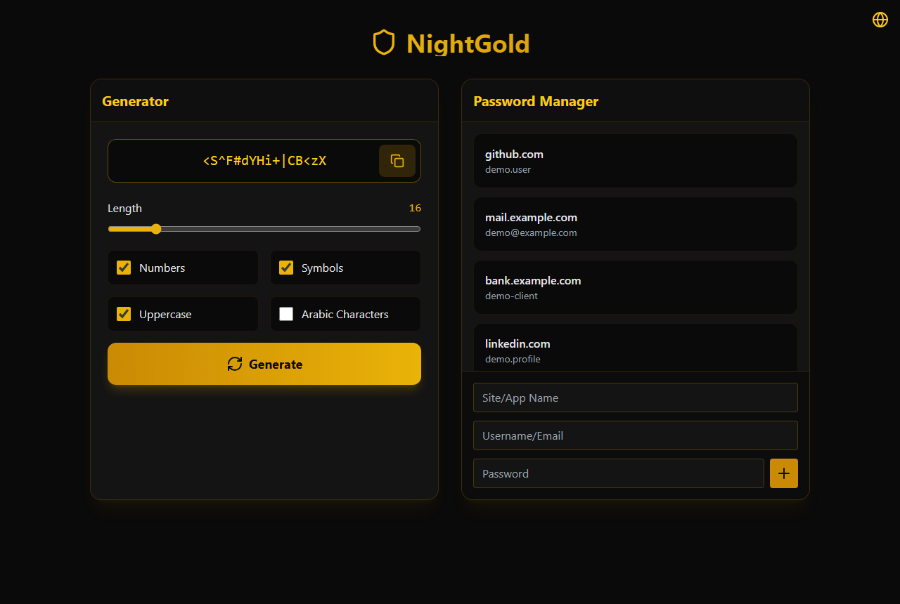
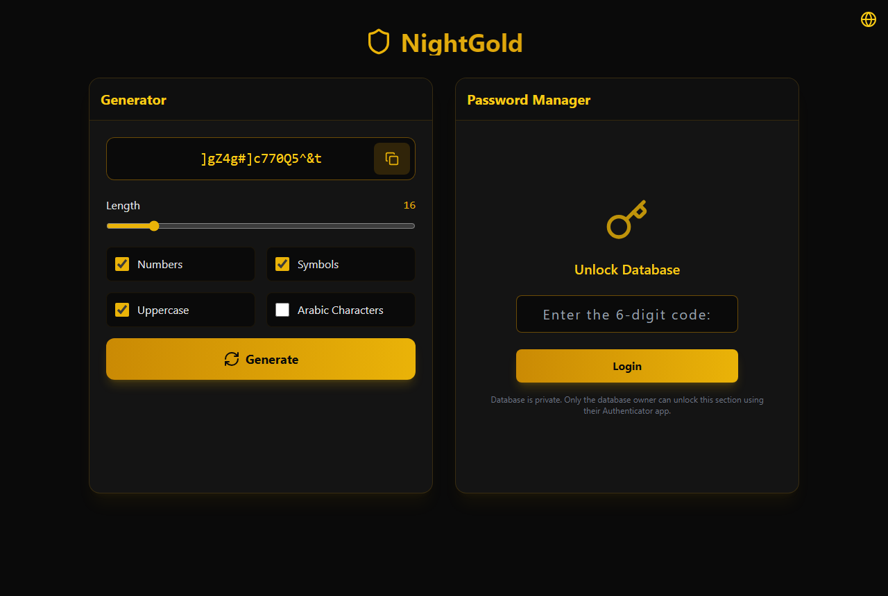
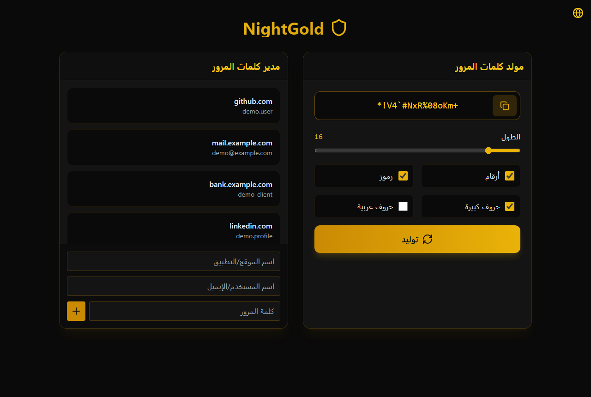

# NightGold V1 — Password Generator & Vault

The first version of [NightGold](https://github.com/Ahshika/NightGold-Password-Manager). A desktop password tool built with **Electron**, **React**, and **Tailwind CSS**. Generate customizable passwords on the fly, then manage saved credentials in a local vault protected by **TOTP (2FA)** and **AES-256-CBC** encryption.

## Features

- **Password generator** — length 8–64; uppercase, numbers, symbols, optional Arabic characters; one-click copy
- **Local password vault** — save site, username, and password; unlock with authenticator code
- **Encrypted storage** — passwords encrypted at rest in SQLite (`userData/passwords.sqlite`)
- **Bilingual UI** — Arabic (RTL) and English
- **Windows installer** — packaged with electron-builder (NSIS)

## Tech stack

Electron · React · Vite · Tailwind CSS · SQLite3 · Speakeasy (TOTP) · i18next

## Screenshots



| Generator with the vault locked | Arabic interface (RTL) |
| --- | --- |
|  |  |

<sub>Screenshots use made-up demo data.</sub>

## Versions

**V1** → [V2](https://github.com/Ahshika/Password-Generator-V2) → [V3 (NightGold Password Manager & File Locker)](https://github.com/Ahshika/NightGold-Password-Manager)

## Getting started

```bash
npm install
npm run dev      # development
npm run build    # production + Windows installer → release/
```

## Security notes

This is a portfolio / learning project. Before using it with real secrets:

- Password generation uses `Math.random()` rather than `crypto.getRandomValues` — upgrade for production use
- The encryption key is stored in the same SQLite database as the ciphertext
- The TOTP secret is embedded in source — replace with per-user setup before any public release

## Disclaimer

Review security practices before using with real secrets in production.

---

## العربية

# NightGold — مدير كلمات المرور

تطبيق سطح مكتب لتوليد كلمات مرور قابلة للتخصيص وإدارة بيانات الدخول محليًا، مع خزنة محمية برمز **TOTP** وتشفير **AES-256-CBC**.

### المميزات

- مولّد كلمات مرور (8–64 حرفًا، خيارات أحرف وأرقام ورموز وحروف عربية)
- خزنة محلية مع فتح بالمصادقة الثنائية
- تخزين مشفّر في SQLite
- واجهة عربية/إنجليزية مع دعم RTL
- مثبّت Windows (NSIS)

### التشغيل

```bash
npm install
npm run dev
npm run build
```

---

## GitHub topics

`electron` `react` `vite` `tailwindcss` `password-manager` `password-generator` `desktop-app` `sqlite` `totp` `i18n` `arabic` `windows`

## Social copy

Ready-to-paste text for GitHub About and LinkedIn is in [docs/GITHUB_LINKEDIN.md](docs/GITHUB_LINKEDIN.md).
